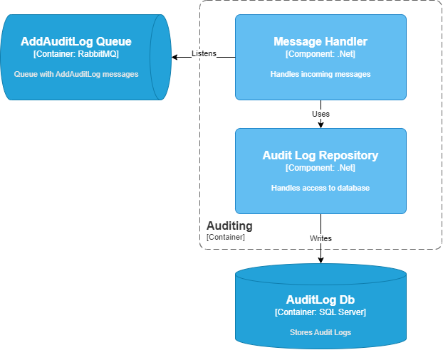

# Auditing Context

Context is responsible for gathering all changes that happening within the system.
Changes are saved to the SQL database so later we can provide full details of the changes.

## Architecture
Below you can find solution architecture diagram (in ADRs you can find more details)

From the diagram, we can simplicity of the context. Currently, data are save as they are. No data transformation happens.
The two main dependencies are the moment:
- RabbitMQ - consumes message from there
- SQL Server - writes audits there

## Architecture Decision Records
Decisions that influences only Auditing Context
 - Auditing Relationship Decision [Link](Documentation/ADRs/AuditingRelationship.md)
