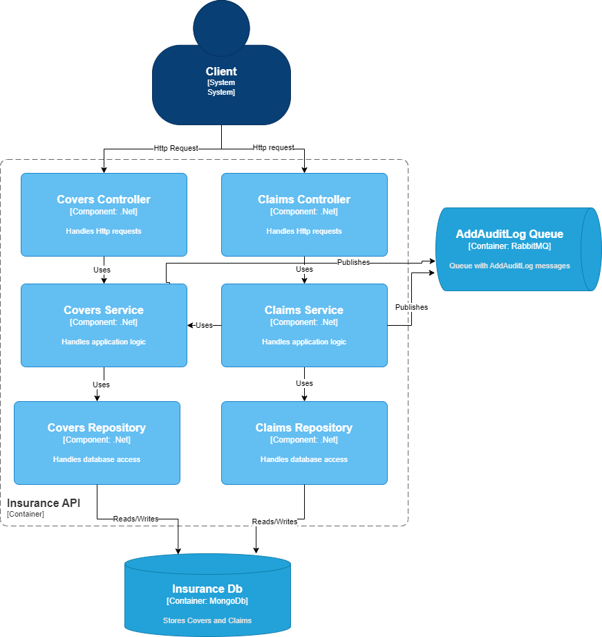

# Insurance Context

Context contains two sub-domains:
- Covers - responsible for managing covers
- Claims - responsible for managing claims

## Architecture
Below you can find solution architecture diagram (in ADRs you can find more details)

Diagram shows that both domains writes their data to the same SQL database. Also both publishes messages to RabbitMQ.
We can see that Claims domain depend on Covers.

## Architecture Decision Records
Decisions that influences only Auditing Context
 - Domains Placement [Link](Documentation/ADRs/DomainsPlacement.md)
 - Domains Architecture [Link](Documentation/ADRs/DomainsArchitecture.md)
