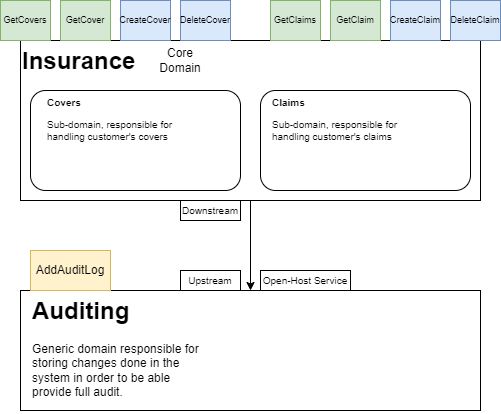

# Insurance system

## Domains
System contains two domains at the moment:
- Insurance with sub-domains: Covers and Claims
- Auditing

## Context Map
Below you can find context map

## Architecture Decision Records
Decisions that influences on the entire system
 - Auditing Relationship Decision [Link](Documentation/ADRs/AuditingRelationship.md)

## How To Run
In the main directory, you can find `docker-compose` file. Simple running `docker-compose up --detach` will create entire infrastructure and run Insurance API and Auditing worker.
